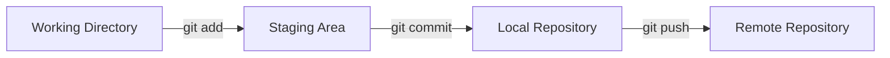

[🏠 Voltar ao Início](../../README.md) | [Próximo Módulo ➡️](../02-Introduction-to-GitHub/README.md)
***

# Introduction to Git

> [!NOTE]
> Este módulo aborda os fundamentos do controle de versão e do Git, sistema de controle de versão distribuído mais popular do mundo.

## 1. O que é Controle de Versão?

O controle de versão é um sistema que registra as alterações feitas em um arquivo ou conjunto de arquivos ao longo do tempo. Ele permite que você recupere versões específicas mais tarde.

### Benefícios:
- **Histórico Completo:** Cada alteração é documentada (quem, quando, o quê).
- **Trabalho Paralelo:** Várias pessoas podem trabalhar no mesmo projeto sem sobrescrever o código umas das outras.
- **Segurança:** Facilidade para reverter alterações em caso de erros.

## 2. O que é o Git?

O Git é um sistema de controle de versão **distribuído** (DVCS). Isso significa que cada desenvolvedor tem uma cópia completa do repositório, incluindo todo o seu histórico, em sua máquina local.

### Diferenças do Git para outros sistemas:
Em sistemas centralizados (como SVN), há um servidor central e os clientes fazem checkout apenas da versão mais recente dos arquivos. No Git, o espelhamento é total.

## 3. Os Três Estados do Git

Os arquivos em um repositório Git podem estar em um de três estados principais:

| Estado | Descrição |
|--------|-----------|
| **Modified (Modificado)** | Você alterou o arquivo, mas ainda não o confirmou no banco de dados. |
| **Staged (Preparado)** | Você marcou um arquivo modificado em sua versão atual para ir no próximo commit. |
| **Committed (Consolidado)**| Os dados estão armazenados com segurança no banco de dados local. |

## 4. Fluxo de Trabalho Básico



## 5. Comandos Essenciais

### Configuração Inicial
```bash
git config --global user.name "Seu Nome"
git config --global user.email "seuemail@exemplo.com"
```

### Inicialização e Clonagem
```bash
# Inicializa um repositório local novo
git init

# Clona um repositório existente
git clone <url-do-repositorio>
```

### O Ciclo de Vida do Arquivo
```bash
# Verifica o status dos arquivos
git status

# Adiciona arquivos à Staging Area
git add arquivo.txt
git add . # Adiciona tudo

# Cria um commit com uma mensagem
git commit -m "Adiciona funcionalidade X"
```

### Repositórios Remotos
Trabalhando com o GitHub:
- `git remote add origin [URL]`: Conecta seu repositório local ao GitHub.
- `git push -u origin main`: Envia (sobe) seus commits locais para a nuvem.
- `git pull`: Puxa (baixa) as alterações da nuvem para a sua máquina.

### Verificando o Histórico
```bash
# Mostra o log de commits
git log
git log --oneline --graph
```

---

> [!TIP]
> **📚 Leitura Oficial Recomendada:** Acesse a pasta `docs/` do nosso projeto para baixar os PDFs oficiais das **[Folhas de Dicas do Git (Git Cheat Sheets)](../../docs/README.md#📝-guias-rápidos-git-cheat-sheets)**. Elas resumem de forma muito visual todos os comandos acima para uso no dia a dia!

---
