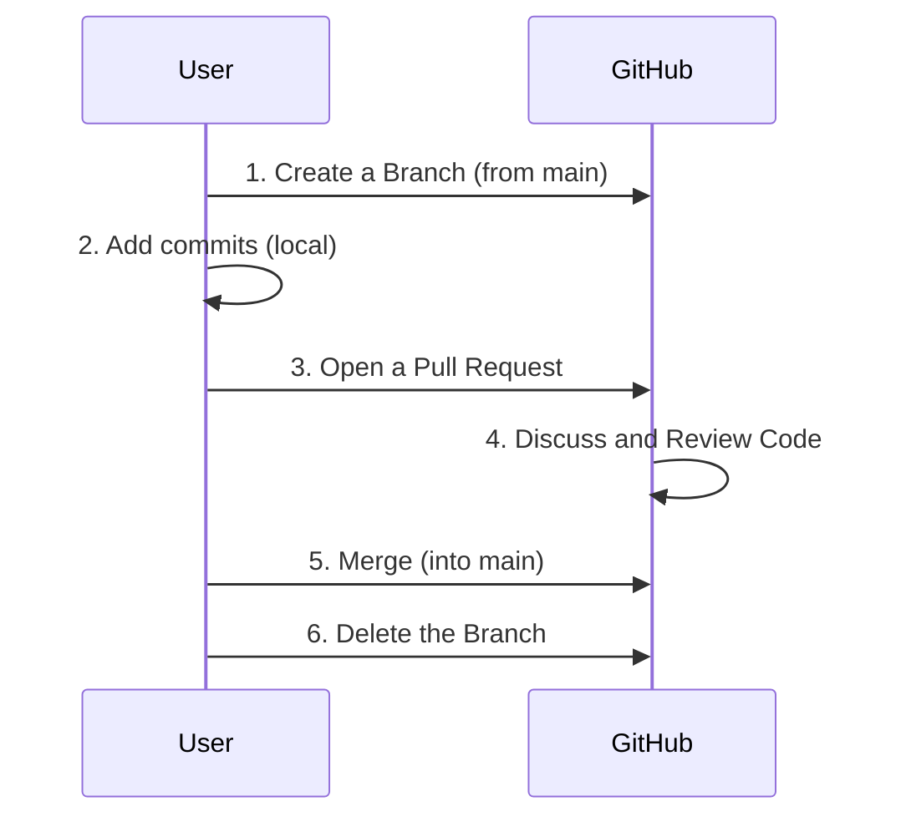

[⬅️ Módulo Anterior](../01-Introduction-to-Git/README.md) | [🏠 Voltar ao Início](../../README.md) | [Próximo Módulo ➡️](../03-Introduction-to-GitHubs-products/README.md)
***

# Introduction to GitHub

> [!NOTE]
> Este módulo explora a plataforma GitHub, seus principais recursos para colaboração e hospedagem de código, e a diferença entre o Git (a ferramenta local) e o GitHub (o serviço online).

## 1. O que é o GitHub?

O GitHub é uma plataforma de hospedagem de código em nuvem baseada no sistema de controle de versão Git. Ele facilita a colaboração entre desenvolvedores através de uma interface web, além de fornecer diversas ferramentas de gerenciamento de projetos.

### Git vs. GitHub

| Git | GitHub |
|-----|--------|
| Software instalado localmente no seu computador. | Serviço web de hospedagem (Cloud). |
| Sistema de controle de versão em si (DVCS). | Interface gráfica e funcionalidades extras baseadas no Git. |
| Gerencia histórico, commits e branches localmente. | Permite colaboração remota, Pull Requests, Issues, etc. |

## 2. Conceitos Centrais do GitHub

### Repositório (Repo)
O local onde todos os arquivos do seu projeto, bem como o histórico de cada revisão, são armazenados. Pode ser público ou privado.

### Clone, Fork e Remote
- **Remote:** Um repositório armazenado na internet (ex: no GitHub).
- **Clone:** Fazer o download de um repositório existente no GitHub para a sua máquina local.
- **Fork:** Criar uma cópia de um repositório de outra pessoa para a sua própria conta do GitHub, permitindo que você faça alterações sem afetar o projeto original.

### Branching (Ramificação)
Branches permitem que você desenvolva recursos isolados uns dos outros. A branch principal geralmente é chamada de `main` ou `master`.

### Pull Requests (PR)
O coração da colaboração no GitHub. Um PR é uma solicitação para mesclar (merge) as alterações que você fez em uma branch específica para outra branch (geralmente a branch principal). É onde acontece a revisão de código (Code Review).

### Issues
Ferramenta integrada para rastreamento de bugs, solicitações de recursos (features) e gerenciamento de tarefas no nível do repositório.

## 3. O Fluxo do GitHub (GitHub Flow)

O GitHub Flow é um fluxo de trabalho leve baseado em branches que suporta o desenvolvimento e a implantação contínuos.



## 4. Resolvendo Conflitos de Merge
- Conflitos ocorrem quando duas pessoas editam a mesma linha de um arquivo ou quando um arquivo é deletado enquanto outro o edita.
- O Git marca o arquivo com os marcadores de conflito (`<<<<<<<`, `=======`, `>>>>>>>`).
- O desenvolvedor deve editar o arquivo manualmente, escolher qual código manter (ou mesclar ambos) e depois commitar a resolução.

---

> [!TIP]
> **📚 Leituras Oficiais Recomendadas:**
> - **[Como Funciona o GitHub Flow (Diagramado)](../../docs/README.md#1-o-github-flow):** Entenda visualmente o ciclo de vida completo de uma branch até o PR.
> - **[Sintaxe de Markdown no GitHub](../../docs/README.md#6-sintaxe-de-markdown):** Aprenda a formatar as issues e READMEs que você vai criar em seus repositórios.

---

## 5. Comandos de Interação com o GitHub

```bash
# Adicionar um repositório remoto (linkar seu repo local com o GitHub)
git remote add origin <url-do-repositorio>

# Verificar os remotos configurados
git remote -v

# Enviar as alterações locais para o GitHub
# A flag -u define o upstream para pushes futuros
git push -u origin main

# Puxar as alterações mais recentes do GitHub para o seu repositório local
git pull origin main
```
