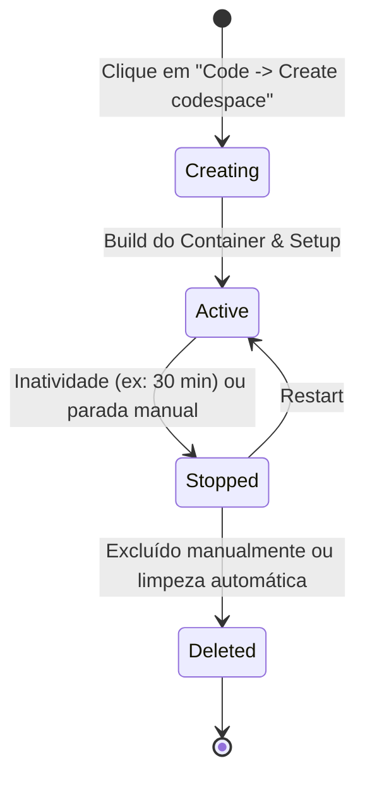

[⬅️ Módulo Anterior](../05-Introduction-to-GitHub-Copilot/README.md) | [🏠 Voltar ao Início](../../README.md) | [Próximo Módulo ➡️](../07-Manage-work-with-GitHub-Projects/README.md)
***

# Code with GitHub Codespaces

> [!NOTE]
> Este módulo apresenta o GitHub Codespaces, uma solução que oferece ambientes de desenvolvimento completos, hospedados na nuvem e acessíveis de qualquer lugar (navegador ou IDE local).

## 1. O que é o GitHub Codespaces?

O GitHub Codespaces é um ambiente de desenvolvimento em nuvem, baseado em contêineres Docker (tecnologia de Devcontainers). Em poucos segundos, você pode iniciar um ambiente de desenvolvimento pronto para uso para qualquer repositório no GitHub.

### Por que usar?
- **Adeus ao "na minha máquina funciona":** O ambiente é padronizado e configurado via código. Todos os desenvolvedores do projeto terão exatamente as mesmas dependências, ferramentas e versões.
- **Onboarding rápido:** Um novo desenvolvedor não precisa perder dias instalando Node.js, Python, bancos de dados e configurando a IDE. Ele clica num botão e começa a codar.
- **Acesso de qualquer lugar:** Você pode codar a partir do navegador (VS Code web) num iPad, por exemplo.
- **Performance escalável:** Você pode escolher máquinas mais potentes (mais RAM e CPU) temporariamente para compilar projetos pesados.

## 2. Devcontainers (A Mágica por Trás)

A configuração de um Codespace é feita através de arquivos de configuração em uma pasta `.devcontainer`.

- `.devcontainer/devcontainer.json`: O arquivo mestre que diz qual imagem base do Docker usar, quais extensões do VS Code pré-instalar e quais comandos rodar após a criação.

### Exemplo Básico de Configuração
Se você tiver um projeto em Node.js, você diz ao GitHub que o Codespace deve nascer já com a versão 18 instalada e com a extensão do ESLint ativa no VS Code.

## 3. Ciclo de Vida de um Codespace

## 4. Personalização

- **Nível de Repositório:** Configurado pelo arquivo `.devcontainer/devcontainer.json` (aplicado a todos que abrirem o projeto).
- **Nível de Usuário (Dotfiles):** Você pode apontar o GitHub para um repositório público contendo seus `dotfiles` (arquivos `.bashrc`, `.vimrc`, aliases do git). Assim, todo Codespace que *você* abrir (em qualquer projeto) já terá o terminal customizado ao seu gosto.
