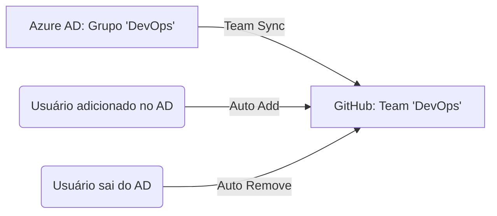

[⬅️ Módulo Anterior](../04-Introduction-GitHub-administration/README.md) | [🏠 Voltar ao Início](../../README.md) | [Próximo Módulo ➡️](../06-Introduction-to-pull-requests/README.md)
***

# Authenticate and authorize user identities on GitHub

> [!NOTE]
> Este módulo detalha as opções de autenticação e autorização no GitHub Enterprise. A segurança começa com a verificação de identidade e continua garantindo que usuários possuam os acessos corretos através de ferramentas organizacionais robustas.

## 1. Gerenciamento de Identidade e Acesso

A autenticação é a porta de entrada. Interações seguras com o GitHub começam na identidade. Embora contas individuais usem usuário/senha, empresas exigem métodos avançados (2FA, senhas biométricas).

### Métodos Modernos de Autenticação
- **Chaves de acesso (WebAuthn):** Login sem senha, vinculado a dispositivos físicos (YubiKey) ou biometria. Resistente a phishing.
- **GitHub Mobile para 2FA:** Aprovação segura via push notification.
- **OAuth e GitHub Apps:** Ideal para automação e CI/CD, concedendo acesso restrito em vez de senhas completas.
- **Enterprise Managed Users (EMU):** No GitHub Enterprise Cloud, garante que toda autenticação passe estritamente pelo Provedor de Identidade (IdP) da empresa, dando controle centralizado.

## 2. Autenticação de Usuário e SAML SSO

O **Single Sign-On (SSO) SAML** permite que usuários façam login usando as credenciais corporativas (ex: Microsoft Entra ID, Okta).

### Níveis de Implementação de SAML
| Nível | Escopo | Remoção de Usuário (Não Compatível) | Caso de Uso Ideal |
|-------|--------|-------------------------------------|-------------------|
| **Organizacional** | Uma organização específica | Imediata | Testes e pilotos limitados |
| **Empresarial** | Toda a empresa (múltiplas orgs) | Adiada até o próximo acesso | Ampla conformidade unificada |

### Autenticação de Dois Fatores (2FA)
A 2FA é essencial. Ao exigir 2FA para a organização, **todos os membros que não a ativarem são removidos automaticamente** (incluindo contas de bot).

> [!WARNING]
> O GitHub recomenda chaves FIDO2/U2F ou aplicativos TOTP (Time-based One-Time Passwords). O uso de SMS deve ser a última opção, sendo considerado menos seguro.

## 3. Autorização de Usuário (SCIM e PATs)

Após a autenticação (SSO SAML), vem a **autorização**.

### Personal Access Tokens (PATs) de Granularidade Fina
Diferente dos PATs clássicos (que davam acesso quase irrestrito), os PATs Fine-grained permitem restringir acessos a repositórios específicos, possuem data de expiração obrigatória e oferecem melhor rastreabilidade.

### Automação com SCIM
O **SCIM** (System for Cross-domain Identity Management) automatiza o *provisionamento* (criação) e o *desprovisionamento* (remoção) de usuários.

> [!IMPORTANT]
> Sem o SCIM, o SSO SAML **não** suporta desprovisionamento automático. O usuário apenas perde o login, mas a conta não é desvinculada automaticamente das equipes. O SCIM é vital para remover instantaneamente acessos assim que um funcionário sai da empresa.

## 4. Sincronização de Equipe (Team Synchronization)

A Sincronização de Equipe mapeia "Grupos" do IdP (ex: um grupo no Azure AD) diretamente para "Teams" no GitHub.

### Team Sync vs. Group SCIM no GHES
Se você usa o **GitHub Enterprise Server (GHES)** (ambiente hospedado localmente):
- **Team Sync:** Focado apenas em colocar usuários (que *já* possuem conta no GitHub) nas equipes corretas. Não provisiona contas novas.
- **SCIM:** Focado em criar/remover a conta do usuário inteira, automatizando o ciclo de vida completo.

### Limites de Uso
- Máximo de membros por equipe: 5.000
- Máximo de membros por organização: 10.000
- Máximo de equipes por organização: 1.500

---

## 📝 Avaliação do Módulo (Simulado)

Teste seus conhecimentos baseados neste módulo. As respostas corretas estão ocultas para você tentar resolver primeiro!

**1. Que tipo de autenticação de usuário é usado para verificar a identidade de um usuário em relação a um provedor de identidade conhecido?**
- [ ] Autenticação de dois fatores (2FA)
- [ ] Senha única baseada em tempo (TOTP)
- [ ] Autenticação única SAML (SSO SAML)
- [ ] Serviço de mensagens curtas (SMS)

<b>Ver Resposta</b>

<b>Autenticação única SAML (SSO SAML).</b> O SSO SAML é a tecnologia que conecta o GitHub ao Provedor de Identidade (IdP) da sua empresa (ex: Okta, Azure AD) para verificar sua identidade corporativa.

**2. Você é um administrador e deseja habilitar a sincronização de equipe para sua organização. Quais permissões de instalação são necessárias para configurar a sincronização de equipe para o Microsoft Entra ID?**
- [ ] Forneça o URL do locatário
- [ ] Leia os perfis completos de todos os usuários.
- [ ] Gere um token válido de Single Sign-on para Sistemas Web (SSWS).
- [ ] Habilitar Single Sign-On (SSO) SAML

<b>Ver Resposta</b>

<b>Leia os perfis completos de todos os usuários.</b> O Microsoft Entra ID requer permissões para leitura de perfil e acesso ao diretório para poder sincronizar os grupos. (A opção de SSWS é exigida pelo Okta).

**3. Onde o usuário se autentica após habilitar o Single Sign-On SAML?**
- [ ] Com um login do GitHub
- [ ] Com as credenciais da organização
- [ ] Com o Provedor de Identidade (IdP)

<b>Ver Resposta</b>

<b>Com o Provedor de Identidade (IdP).</b> Quando ativado, o GitHub redireciona automaticamente os usuários para a página do IdP da empresa para autenticação antes de conceder acesso aos recursos internos.

**4. Qual método de autenticação de dois fatores oferece suporte ao backup seguro de seus códigos de autenticação na nuvem?**
- [ ] Senha única baseada em tempo (TOTP)
- [ ] Serviço de mensagens curtas (SMS)
- [ ] Chave de segurança

<b>Ver Resposta</b>

<b>Senha única baseada em tempo (TOTP).</b> Aplicativos TOTP (como Microsoft Authenticator ou Authy) geram senhas baseadas em tempo e oferecem suporte a backup na nuvem, além de funcionarem offline, sendo o método recomendado pelo GitHub.

