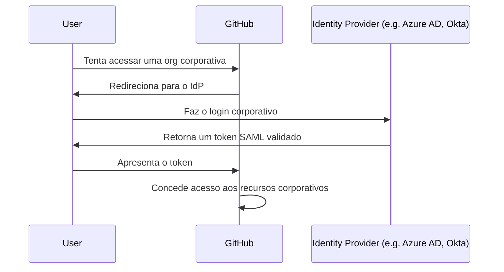

[⬅️ Módulo Anterior](../04-Introduction-GitHub-administration/README.md) | [🏠 Voltar ao Início](../../README.md)
***

# Authenticate and authorize user identities on GitHub

> [!NOTE]
> Este módulo mergulha profundamente em como o GitHub gerencia o "Quem é você?" (Autenticação) e "O que você pode fazer?" (Autorização).

## 1. Autenticação (Authentication) vs. Autorização (Authorization)

Para gerenciar o acesso de forma segura, é preciso entender a diferença entre os dois conceitos:

- **Autenticação (AuthN):** O processo de verificar a identidade de um usuário. Responde à pergunta: *"Você é realmente quem diz ser?"*. (Ex: Login com usuário/senha + Token SMS).
- **Autorização (AuthZ):** O processo de verificar quais recursos o usuário tem permissão para acessar após ser autenticado. Responde à pergunta: *"Você tem permissão para modificar o repositório X?"*. (Ex: Permissão de Read, Write, Admin).

## 2. Autenticação Pessoal e 2FA

O GitHub encoraja fortemente, e em muitos contextos exige, a **Autenticação em Duas Etapas (2FA)**.
Se um administrador de Organização exigir 2FA, os membros que não a tiverem ativada serão removidos automaticamente da organização.

## 3. Single Sign-On (SAML SSO)

Para empresas, gerenciar logins de centenas de funcionários individualmente é inviável e inseguro. O GitHub Enterprise oferece suporte a **SAML SSO** (Security Assertion Markup Language Single Sign-On).

### O Fluxo SAML

**Identity Providers (IdP) Comuns:**
- Microsoft Entra ID (antigo Azure AD)
- Okta
- Ping Identity
- Google Workspace

> [!IMPORTANT]
> Quando o SAML SSO é ativado, os desenvolvedores *ainda usam suas contas pessoais do GitHub*. Eles apenas vinculam sua conta pessoal à identidade corporativa (IdP) e precisam fazer um login "extra" (o login corporativo) diariamente para obter um token de sessão válido que permite ver os repositórios da empresa.

## 4. Autorização: Papéis de Repositório (Repository Roles)

A autorização determina os botões que você pode clicar em um repositório. O GitHub tem níveis padrão:

| Papel (Role) | Permissões (O que pode fazer) | Casos de Uso |
|--------------|-------------------------------|--------------|
| **Read** | Pode clonar, baixar o código, abrir Issues e comentar. *Não pode fazer push de código.* | Não-desenvolvedores, gerentes de produto, times de QA avaliando bugs. |
| **Triage** | Tudo do Read + pode gerenciar Issues/PRs (fechar, atribuir labels), mas ainda *não pode alterar o código*. | Contribuidores externos que ajudam a organizar a fila de Issues. |
| **Write** | Tudo do Triage + pode fazer `git push` para o repositório, mesclar PRs (merge). | Desenvolvedores ativamente codificando no projeto. |
| **Maintain** | Tudo do Write + gerenciar configurações básicas do repo sem ter acesso a dados destrutivos. | Líderes técnicos da equipe. |
| **Admin** | Acesso total. Pode deletar o repositório, gerenciar segurança (CodeQL, Secrets), adicionar/remover usuários. | Donos do projeto e administradores organizacionais. |

## 5. Autorização: Team Synchronization

Em grandes empresas, quando alguém sai da companhia (offboarding) ou muda de departamento, os admins esquecem de remover a permissão do GitHub. Isso é um risco grave de segurança.

A **Team Synchronization (Sincronização de Equipes)** resolve isso conectando o IdP (ex: Azure AD) ao GitHub.

- O GitHub mapeia os "Grupos de Segurança" do IdP (ex: `Backend-Devs`) para um "GitHub Team".
- Se um funcionário for demitido, o TI remove ele do Azure AD. Automaticamente, via SCIM/API, o acesso dele aos repositórios do GitHub é revogado instantaneamente, sem intervenção humana manual.
