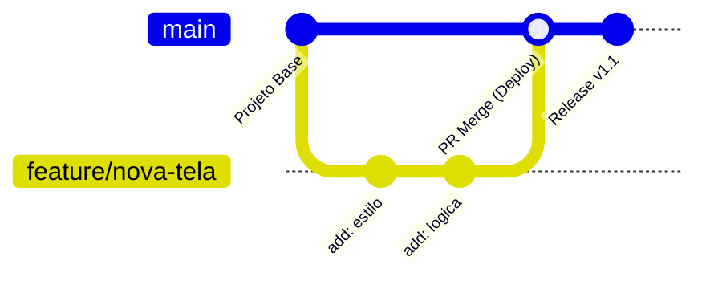
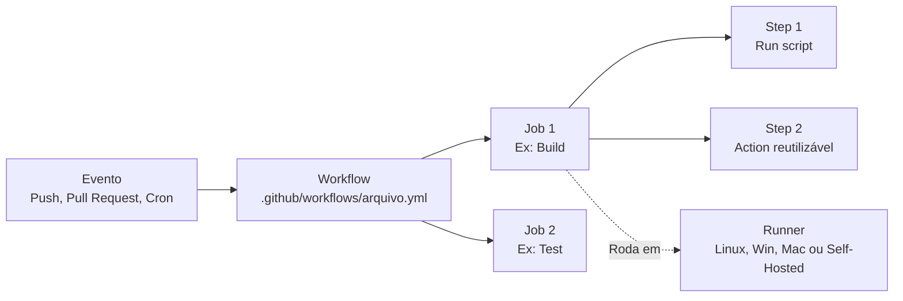
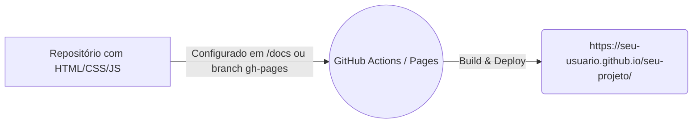

# Documentação de Apoio: GitHub Foundations

Esta pasta contém materiais e recursos oficiais para apoiar os seus estudos para a certificação **GitHub Foundations**.

## 📄 [GitHub Foundations Exam Study Guide](./github-foundations-exam-study-guide.pdf)

O guia de estudos oficial do GitHub (em PDF) foi adicionado para guiar a sua preparação. Ele destrincha a prova em **7 Domínios Principais**, mostrando exatamente as habilidades cobradas no exame.

### Resumo dos 7 Domínios Cobrados:

1. **Introduction to Git and GitHub:** Diferenças entre Git e GitHub, controle de versão, o que é repositório, commit, branch, remote e o GitHub Flow.
2. **Working with GitHub Repositories:** Arquivos base (README, LICENSE, CONTRIBUTING), navegação, templates, clonagem, branches e feature previews.
3. **Collaboration Features:** Issues, Pull Requests, Discussions, Notifications, Gists, Wikis e GitHub Pages (e a diferença entre criar, converter, fixar ou atribuir).
4. **Modern Development:** Introdução básica ao **GitHub Actions** (CI/CD), **GitHub Copilot** (IA) e **GitHub Codespaces** (Containers de dev na nuvem).
5. **Project Management:** Projetos do GitHub (GitHub Projects), views, automações, milestones, labels e Saved Replies.
6. **Privacy, Security, and Administration:** Autenticação (2FA), permissões, visibilidade de repositório, proteção de branch, EMUs (Enterprise Managed Users) e aba de Segurança.
7. **Benefits of the GitHub Community:** Código aberto (Open Source) versus InnerSource, GitHub Sponsors, fluxo de Fork, como seguir pessoas/organizações e o GitHub Marketplace.

> [!TIP]
> Use este guia em PDF como um checklist! Conforme avança nos diretórios de `Part-1` e `Part-2`, vá cruzando os conteúdos estudados com os objetivos detalhados no guia.

---

## 📝 Guias Rápidos (Git Cheat Sheets)

Adicionamos 3 versões oficiais da **Git Cheat Sheet** fornecidas pelo GitHub. Estes PDFs são a melhor referência de mesa para os comandos essenciais do dia a dia de um desenvolvedor:
1. **[github-git-cheat-sheet.pdf](./github-git-cheat-sheet.pdf):** Versão completa oficial em Português.
2. **[github-git-cheat-sheet-EN.pdf](./github-git-cheat-sheet-EN.pdf):** Versão completa oficial em Inglês.
3. **[git-cheat-sheet-education.pdf](./git-cheat-sheet-education.pdf):** Versão resumida com foco educacional.

**Principais tópicos cobertos nas Cheat Sheets:**
- **Configuração (`git config`):** Definir nome e e-mail atrelados aos commits.
- **Criação e Obtenção (`git init`, `git clone`):** Iniciar repositórios.
- **Mudanças (`git status`, `git diff`, `git add`, `git commit`):** O ciclo de versionamento.
- **Sincronização (`git fetch`, `git pull`, `git push`):** Trabalhando com o remote.
- **Bifurcação (`git branch`, `git checkout`, `git merge`):** Fluxo de branches.

---

## 🧠 Deep Research: Documentação Oficial Avançada

Realizamos um "Mergulho Profundo" nas documentações do ecossistema GitHub. Abaixo estão os conceitos oficiais diagramados para melhor aprendizado visual.

### 1. O GitHub Flow
[📖 Documentação Oficial do GitHub Flow](https://docs.github.com/pt/get-started/using-github/github-flow)

O GitHub Flow é o fluxo de trabalho leve baseado em *branching*, suportando equipes e projetos em implementações regulares e contínuas.



**As 6 Etapas do Flow:**
1. **Criar um branch:** A partir da `main`, isole seu trabalho.
2. **Fazer commits:** Salve suas alterações regularmente.
3. **Abrir Pull Request:** Inicie a discussão sobre as suas alterações.
4. **Revisar código:** Colaboradores comentam, testam e aprovam.
5. **Fazer o Merge:** O código é integrado na branch base.
6. **Excluir o branch:** Mantém o repositório limpo após o merge.

### 2. Segurança de Cadeia de Suprimentos (Dependabot)
[📖 Alertas do Dependabot](https://docs.github.com/pt/code-security/concepts/supply-chain-security/dependabot-alerts)

O Dependabot ajuda a corrigir vulnerabilidades em dependências, detectando versões desatualizadas de pacotes (como `npm`, `pip`) no seu projeto e até criando PRs automáticos.

```mermaid
graph TD;
    A[Repositório com Manifesto (ex: package.json)] --> B{Dependabot Scanner};
    B -- Verifica CVEs conhecidos --> C[GitHub Advisory Database];
    C -- Encontrou Falha! --> D[Alerta na aba Security];
    D --> E[Dependabot cria PR automático com a versão corrigida];
    E --> F[Testes de CI];
    F --> G[Merge do Dev];
```

### 3. Segurança de Segredos (Secret Scanning)
[📖 Secret Scanning](https://docs.github.com/pt/code-security/concepts/secret-security/secret-scanning)

Prevenção de vazamento de credenciais (Senhas, Tokens de API, Chaves AWS). O GitHub varre repositórios inteiros atrás de segredos expostos no código.
- Se o repo for **Público**: O GitHub notifica o provedor de serviço (ex: a AWS revoga a chave).
- Se o repo for **Privado** (com GitHub Advanced Security): Bloqueia o push preventivamente ou alerta os administradores.

### 4. GitHub Actions (Automação e CI/CD)
[📖 Entenda o GitHub Actions](https://docs.github.com/pt/actions/get-started/understand-github-actions)

O GitHub Actions automatiza, personaliza e executa os fluxos de desenvolvimento de software (workflows).


**Conceitos Chave:**
- **Events:** O gatilho (trigger) que aciona o workflow.
- **Workflows:** O arquivo YAML principal (o processo automatizado).
- **Jobs:** Conjunto de etapas (`steps`) rodando na mesma máquina (`runner`).
- **Actions:** Aplicativos customizados e complexos, empacotados em um "passo" para uso.

### 5. GitHub Pages
[📖 O que é o GitHub Pages?](https://docs.github.com/pt/pages/getting-started-with-github-pages/what-is-github-pages)

Um serviço de hospedagem de site estático a partir de um repositório GitHub. Não precisa de servidor, e você pode customizar domínios e utilizar geradores como o *Jekyll*.



### 6. Sintaxe de Markdown
[📖 Basic Writing and Formatting Syntax](https://docs.github.com/pt/get-started/writing-on-github/getting-started-with-writing-and-formatting-on-github/basic-writing-and-formatting-syntax)

A forma padrão de escrever no GitHub, usando formatações de texto rico baseadas em texto plano.
- **Negrito:** `**texto**`
- **Títulos:** `# H1`, `## H2`
- **Listas e Tarefas:** `- [x] Tarefa feita`
- **Menções e Links Cruzados:** `@nome_usuario` ou `#42` (Issue).

