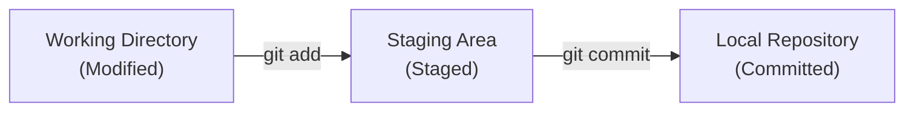
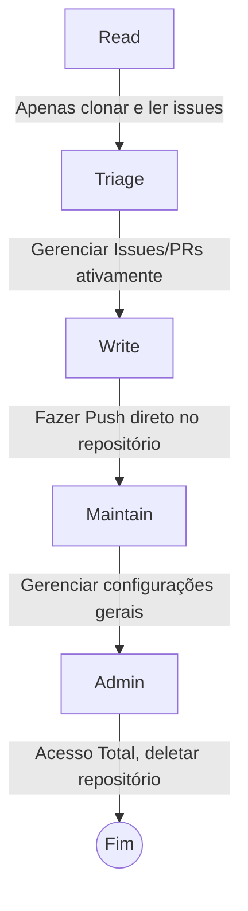
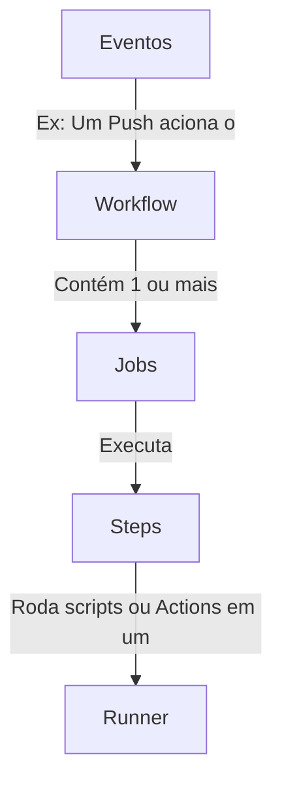

[Voltar ao Início](../README.md)
***

# Guia Definitivo: GitHub Foundations Certification

Este diretório (`/exam-guide`) foi criado como a sua "Mesa de Estudos Final". Nós duplicamos todos os PDFs importantes para cá e consolidamos as melhores dicas de preparação e anotações vindas de desenvolvedores experientes e mantenedores da comunidade.

Leia este guia nas semanas que antecedem o seu exame.

---

## Domínios do Exame (Domains for the Exam)

O exame GitHub Foundations é dividido nos seguintes conhecimentos, habilidades e tópicos específicos, com seus respectivos pesos:

| Domain Breakdown | Exam Percentage |
| --- | --- |
| Domain 1: Introduction to Git and GitHub | 22% |
| Domain 2: Working with GitHub Repositories | 8% |
| Domain 3: Collaboration Features | 30% |
| Domain 4: Modern Development | 13% |
| Domain 5: Project Management | 7% |
| Domain 6: Privacy, Security and Administration | 10% |
| Domain 7: Benefits of the GitHub Community | 10% |

---

## Formato da Prova (O Que Esperar)

- **Duração:** 120 Minutos (2 Horas).
- **Questões:** 60 a 75 questões de múltipla escolha.
- **Nota de Aprovação:** 700 / 1000.
- **Idioma:** Inglês.
- **Foco:** Diferente da maioria das certificações técnicas, esta prova cobra muito **conceito e processos comunitários**, não apenas código puro ou CLI.

---

## Recursos Locais Disponíveis

- **[O Guia Oficial do Exame (PDF)](./github-foundations-exam-study-guide.pdf):** A ementa oficial detalhada pela Microsoft. Use como checklist.
- **[Git Cheat Sheet (Completa PT)](./github-git-cheat-sheet.pdf):** Referência completa de comandos em Português.
- **[Git Cheat Sheet (Completa EN)](./github-git-cheat-sheet-EN.pdf):** Referência completa de comandos em Inglês (Útil, pois a prova é em inglês).
- **[Git Cheat Sheet (Resumo Education)](./git-cheat-sheet-education.pdf):** A versão resumida e rápida da folha de dicas.

---

## Deep Research Insights: Dicas da Comunidade

Compilamos as armadilhas e focos de estudo relatados por quem já passou na prova, cruzando dados de repositórios famosos de certificação:

### 1. Introduction to Git & Repositories
**Os 3 Estados do Git:** Você precisa saber de cor a diferença entre os estados locais de um arquivo.

- **Modified:** Arquivo alterado, mas não salvo no banco de dados do git.
- **Staged:** Arquivo marcado para o próximo commit.
- **Committed:** Salvo com segurança no banco de dados local.

**Comandos CLI:** A prova cobra cenários práticos da ordem de execução: `git clone` -> `git fetch` -> `git pull` -> `git push`.

**Componentes de um Repositório Descobrivel:** A prova cobra quais arquivos tornam um projeto aberto e legível para a comunidade. Geralmente são: `README.md`, `LICENSE`, `CONTRIBUTING.md` e `CODE_OF_CONDUCT.md`.

**CODEOWNERS:** Saiba a sintaxe e a localização. O arquivo fica na raiz, na pasta `docs/` ou na `.github/`. Ele é usado para definir quais usuários devem obrigatoriamente aprovar os PRs que modificam pastas ou arquivos específicos.

### 2. Collaboration & Markdown
- **Pull Requests (PRs):** Entenda as guias de um PR (Conversation, Commits, Checks, Files changed) e a diferença entre os botões de merge ("Merge commit", "Squash and merge" e "Rebase and merge").
- **Issues vs Discussions:** *Issues* são para gerenciar trabalho e rastrear bugs. *Discussions* são o fórum da comunidade (perguntas, ideias). É possível converter um no outro.
- **Markdown:** O exame cobra sintaxe básica (negrito, listas e @menções a outros usuários ou #referências a issues).

### 3. Privacy, Security & Administration
**Níveis de Permissão (Roles):** Decore a hierarquia corporativa de acesso a repositórios.

- **Branch Protections:** Regras aplicadas na branch principal (ex: requerer aprovação em PR, checagem de status passar antes do merge, assinar commits criptograficamente).
- **Segurança (GitHub Advanced Security):**
  - **Dependabot:** Procura dependências desatualizadas (ex: bibliotecas npm antigas) e cria PRs automáticos.
  - **Secret Scanning:** Procura Tokens hardcoded no código (chaves da AWS, Azure) e previne vazamentos bloqueando o push ou alertando o admin.

### 4. Project Management
- **GitHub Projects:** Saiba a diferença entre *Projects (Classic)* e os novos *Projects (V2)*. Entenda a automação de movimentação de cartões usando *workflows* de projeto.
- **Milestones (Marcos):** Usados para agrupar Issues e PRs que visam alcançar uma meta específica de prazo (como um Sprint mensal). Possui barra de porcentagem de conclusão.
- **Labels (Rótulos):** Classificação visual de problemas (ex: tag `bug`, `enhancement`).

### 5. Modern Development

**GitHub Actions:** Entenda a hierarquia dos componentes automatizados de CI/CD.

- **GitHub Codespaces:** É um contêiner hospedado no Azure com VS Code rodando direto no navegador, permitindo iniciar ambientes de desenvolvimento sem instalar dependências na máquina local.
- **GitHub Copilot:** Compreenda as diferenças entre os planos de IA (Individual, Business, Enterprise) e os princípios fundamentais da Engenharia de Prompt (Passar um bom contexto para a IA gerar o código correto).

### 6. Comunidade e Cultura
- **Open Source vs InnerSource:**
  - **Open Source:** Código aberto e transparente para o mundo todo.
  - **InnerSource:** Código aberto, mas apenas dentro da sua empresa. Aplica as regras do Open Source em repositórios privados da organização.
- **GitHub Sponsors:** Plataforma de doações integrada ao perfil do GitHub para apoiar financeiramente os desenvolvedores e mantenedores de código aberto que você ou sua empresa utilizam.

---

> [!IMPORTANT]
> A Microsoft e o GitHub frequentemente atualizam as cores e telas da interface. Baseie seus estudos nos conceitos fundamentais da ferramenta (o "Por que" e o "O que" a ferramenta faz). O local de um botão pode mudar na tela com o passar dos anos, mas a teoria de controle de versão é permanente.
